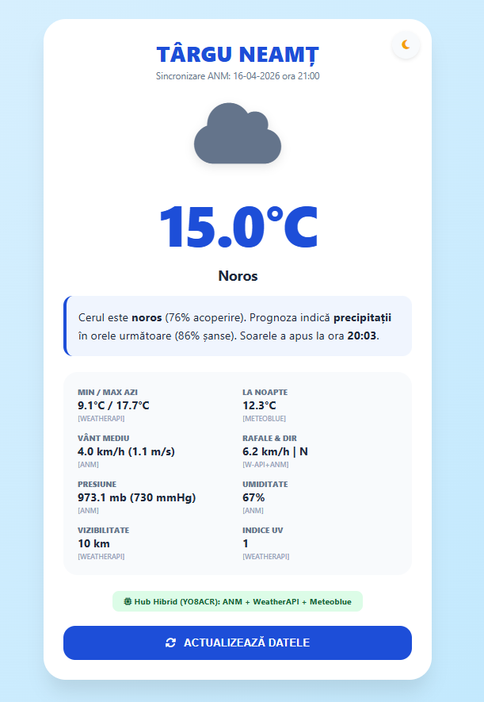
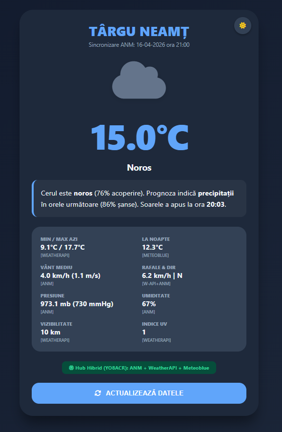

# 🌦️ Prognoză Meteo Dinamică - Târgu Neamț

O aplicație web (widget) modernă și minimalistă care oferă date meteorologice în timp real pentru orașul Târgu Neamț. Proiectul utilizează un model hibrid de colectare a datelor pentru a asigura o precizie maximă.

## 🚀 Caracteristici principale

* **Model Hibrid de Date:** Combină citirile în timp real de la stațiile **ANM** (prin hub-ul YO8ACR) cu prognoze predictive de la **WeatherAPI** și **Meteoblue**.
* **Logică Evolutivă:** Textul prognozei nu este static. Acesta se adaptează în funcție de probabilitatea de precipitații și momentul zilei (ex: calculează automat dacă soarele a apus sau urmează să apună).
* **Design Adaptiv:** Interfață modernă cu suport pentru **Dark Mode** și **Light Mode**.
* **Sincronizare Automată:** Datele se actualizează automat la fiecare 10 minute fără a fi necesară reîncărcarea paginii.
* **Mobile Friendly:** Optimizat pentru a fi adăugat pe ecranul principal al telefonului ca WebApp.

## 📊 Surse de Date (Hub Hibrid)

Aplicația centralizează informații din următoarele surse:
1.  **ANM (Administrația Națională de Meteorologie):** Temperatură curentă, umiditate, presiune și viteza vântului (via `vremea-tg-neamt.yo8acr.workers.dev`).
2.  **WeatherAPI:** Condiții meteo detaliate, acoperirea norilor, indice UV și șanse de precipitații.
3.  **Meteoblue:** Estimări ale temperaturii pentru noaptea curentă.

### 📸 Prezentare Vizuală

## 🖥️ Tehnologii Utilizate

* **HTML5 & CSS3:** Structură și stilizare (variabile CSS pentru teme).
* **JavaScript (Vanilla):** Logică pentru preluarea datelor (Fetch API) și manipularea DOM-ului.
* **FontAwesome:** Pentru iconițe meteo intuitive.
* **Cloudflare Workers:** (Backend-ul furnizat de YO8ACR pentru colectarea datelor ANM).

## 🤝 Contribuții

Aprecierile și contribuțiile sunt binevenite! Proiectul a fost dezvoltat cu pasiune pentru comunitatea locală. 
Mulțumiri speciale către **YO8ACR** pentru furnizarea accesului la datele colectate de la stațiile meteorologice.

---
⭐ Dacă îți place acest proiect, nu uita să îi dai un Star pe GitHub!
